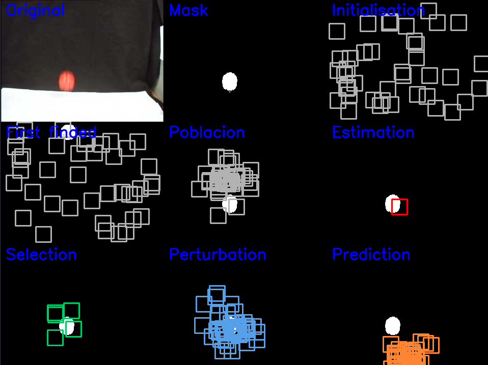

# Particle filter

Visual tracking with particle filter method

#### 👨‍🎓 This project was carried out during my master's degree in computer vision at URJC - Madrid

## Goals

- Detect the ball by using the particle filter method

## Requirements

* Python 3.7+
* numpy ~= 1.21.3
* opencv_python ~= 4.5.5.64

```bash
pip3 install -r requirements.txt
```

## Steps

1) Initial considerations
2) Initialisation
3) Evaluation
4) Estimation
5) Selection
6) Diffusion
7) Prediction

###### More explanations in ```docs/explanations_esp.pdf``` (only in spanish)

## Usage

#### With static perturbation

```bash
python ./src/main_filter.py --directory="data"
```

#### With proportional perturbation

```bash
python ./src/main_filter.py --directory="data" -p
```

###### Press a key to skip image

## Example

<p align="center">
  
</p>
<p align="center">
  <i>Example of the displayed output</i>
</p>

## Structure

    .
    ├── data
    │    └── *.jpg
    ├── docs
    │    └── explanations_esp.pdf
    ├── imgs
    │    └── Screen.png
    ├── README.md
    ├── requirements.txt
    └── src
        ├── filter_class.py
        ├── main_filter.py
        └── particle_class.py


## Authors

* **Luis Rosario** - *Member 1* - [Luisrosario2604](https://github.com/Luisrosario2604)